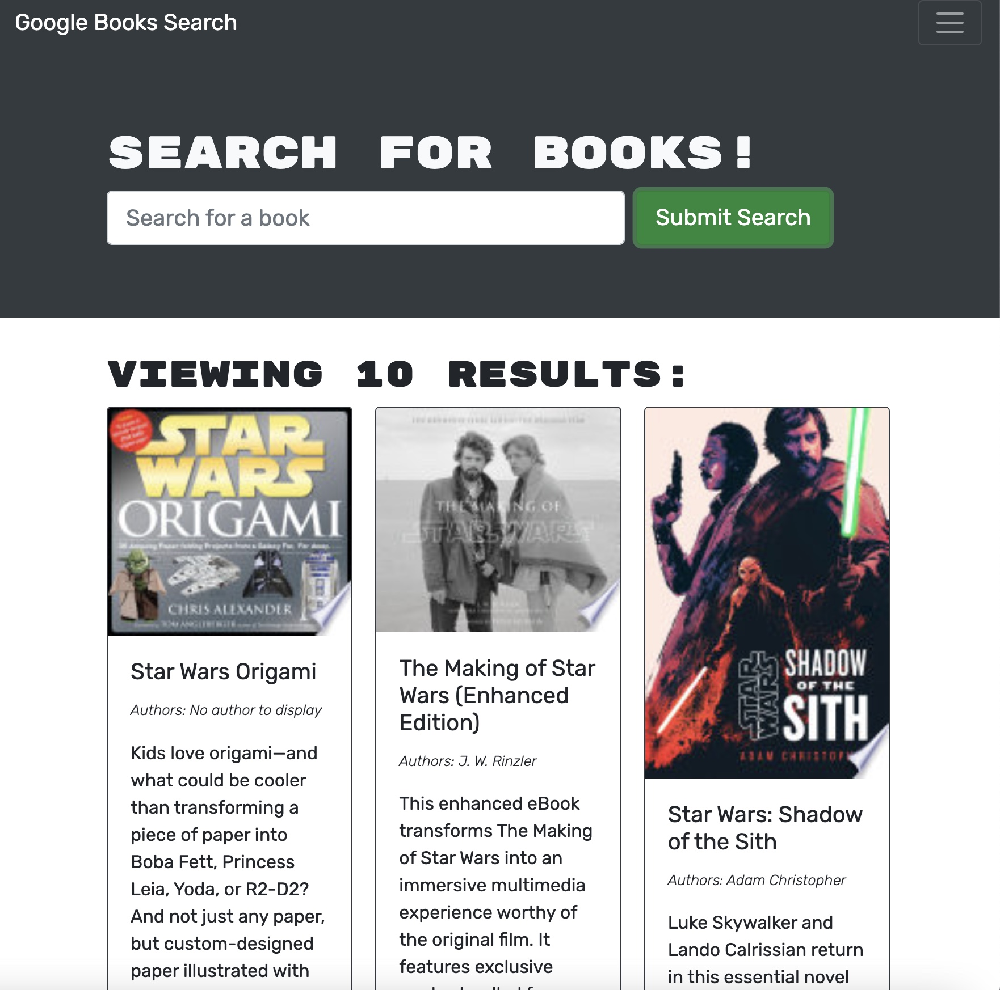

# Book Search Engine Starter Code

## Table of Contents 
1. [Description](#description)
2.  [Visuals](#visuals)
3. [Resources](#resources)

## Author:

Justin Stone

## Description
This program gives the user the ability to search for a book with a keyword and get back any related books, with the authors, awards and a short bio on them.

## Visuals

## Resources

[Repository](https://github.com/Justinstone2001/Book_Search_Engine)

[Video](https://www.youtube.com/watch?v=jL1ToKx9Kbk)